````markdown
<h1 align="center">🚀 n8n on AWS EC2 with Docker</h1>

<p align="center">
  <b>Step-by-step guide to install and run <a href="https://n8n.io/">n8n</a> on AWS EC2 using Docker</b>
</p>

<p align="center">
  
  
  
</p>

---

## 🖥️ Step 1: Install Docker

```bash
sudo apt update -y && sudo apt upgrade -y
sudo apt install -y ca-certificates curl gnupg lsb-release

# Add Docker GPG Key
sudo mkdir -p /etc/apt/keyrings
curl -fsSL https://download.docker.com/linux/ubuntu/gpg | sudo gpg --dearmor -o /etc/apt/keyrings/docker.gpg

# Add Repo
echo \
  "deb [arch=$(dpkg --print-architecture) signed-by=/etc/apt/keyrings/docker.gpg] \
  https://download.docker.com/linux/ubuntu \
  $(lsb_release -cs) stable" | \
  sudo tee /etc/apt/sources.list.d/docker.list > /dev/null

# Install Docker & Compose
sudo apt update -y
sudo apt install -y docker-ce docker-ce-cli containerd.io docker-compose-plugin

# Enable Docker
sudo systemctl enable docker && sudo systemctl start docker
sudo usermod -aG docker $USER
newgrp docker
````

---

## 📥 Step 2: Clone & Run Installer

```bash
git clone https://github.com/ashishlaheri/n8n-docker-install.git
cd n8n-docker-install
chmod +x install-n8n.sh
./install-n8n.sh
```

---

## 🌍 Step 3: Access n8n

🔗 Open in browser:

👉 **http\://<EC2-Public-IP>:5678**

🎉 You now have **n8n running inside Docker** on AWS EC2.

---

## ⚙️ Optional: Customize with `.env`

```ini
N8N_BASIC_AUTH_ACTIVE=true
N8N_BASIC_AUTH_USER=admin
N8N_BASIC_AUTH_PASSWORD=supersecret
N8N_SECURE_COOKIE=false
N8N_PORT=5678
```

---

## 📊 Architecture (Mermaid Diagram)

```mermaid
flowchart TD
    User[👩 User] -->|Browser| EC2[💻 AWS EC2 Instance]
    EC2 -->|Docker| Container[n8n Docker Container]
    Container -->|Port 5678| Workflow[n8n Workflows UI]
```



---

<h3 align="center">✅ Installation Complete</h3>

<p align="center">
  If this project helped you, please ⭐ star the repo & share! <br>
  <b>Happy Automating with n8n 🚀</b>
</p>
```

### ✨ What’s improved

* ✅ **Badges** → gives it a professional open-source look
* ✅ **Centered title & tagline** → like a landing page
* ✅ **Mermaid diagram** → shows architecture visually
* ✅ **Section dividers** → cleaner readability
* ✅ **Call-to-action at the bottom**

---
